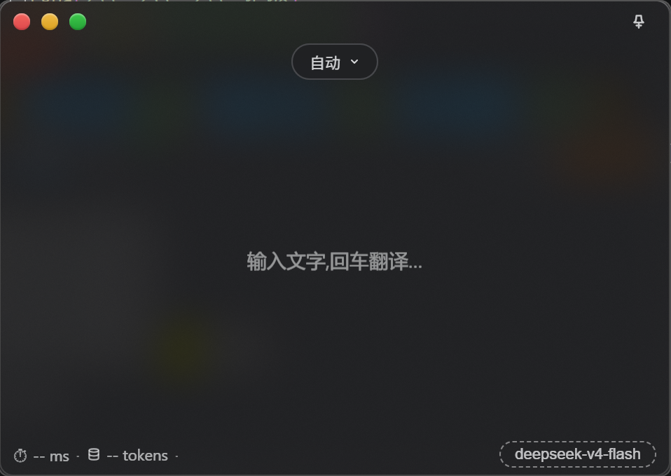

# FrostMirror · 镜语

[](LICENSE)

置顶毛玻璃 AI 翻译小窗 · 译如照镜

一个始终浮在窗口最前面的半透明翻译小窗——输入中文得英文，输入英文得中文，复制即翻，随叫随到。适合阅读外文资料时随手一翻。



## 功能

- **置顶毛玻璃** — 始终浮在所有窗口上方，Win32 亚克力模糊效果，不遮挡阅读
- **输入即翻** — 输入文字回车翻译，含汉字 → 英文，其他语言 → 设备默认语言
- **复制即翻** — 任意应用里复制文本（≤2000 字符），窗口自动浮出翻译，不抢焦点
- **孤词词典** — 输入单个英文单词（可含连字符），自动切换词典模式，列出词性、释义、例句和搭配
- **复制译文** — 结果区一键复制译文，随取随用
- **灵动岛语言胶囊** — 顶部可选固定目标语言（中/英/日/韩/法/德/西/俄/葡/意），默认自动
- **深度模式** — 开启模型思考，翻译质量更高但更慢、更耗 token
- **全局热键** — `Alt+Q` 任意应用呼出窗口，剪贴板有新内容则直接翻译
- **透明度调节** — `Ctrl+=` / `Ctrl+-` 实时调节，单击 ±5%，长按约 10%/秒连续变化，松开自动保存
- **系统托盘** — 关闭缩到托盘不退出，单击显示，右键可退出
- **便携免安装** — 配置存 exe 旁，缓存存 `glass-data/`，不写 C 盘

## 前置要求

- **操作系统**：Windows 10 1803+ / Windows 11（依赖 Win32 亚克力模糊 API）
- **Node.js**：v18 或更高（开发环境 v22）
- **npm**：v9 或更高（开发环境 v11）
- **AI 接口**：任意 OpenAI 兼容的 API（如 [DeepSeek](https://platform.deepseek.com/)、[OpenAI](https://platform.openai.com/) 等），需要自行申请 API Key

## 运行

```bash
npm install
npm start
```

`npm install` 会安装以下依赖：

| 包 | 版本 | 类型 | 用途 |
|---|---|---|---|
| [electron](https://www.electronjs.org/) | ^43.4.0 | devDependency | 桌面应用框架，提供 Chromium + Node.js 运行环境 |
| [koffi](https://github.com/Koromix/koffi) | ^3.1.5 | dependency | 轻量 FFI 库，用于从 Node.js 调用 Win32 `user32.dll` 实现亚克力毛玻璃效果 |

> 国内网络若 `npm install` 下载 Electron 二进制失败，可先设置镜像：`$env:ELECTRON_MIRROR = "https://npmmirror.com/mirrors/electron/"`（PowerShell）。

## 使用

1. **首次启动** — 两步引导：介绍 → 填写 OpenAI 兼容接口地址、模型 ID 和 API Key，点"保存并验证"
2. **翻译** — 输入文字回车；双击结果区或按 Esc 返回输入
3. **复制即翻** — 任意应用里 `Ctrl+C` 复制文本，窗口自动翻译（可在设置中关闭）
4. **词典** — 输入单个英文单词自动进入词典模式
5. **热键** — `Alt+Q` 呼出窗口并翻译剪贴板内容（可在设置中改绑）
6. **红绿灯** — 关闭（缩到托盘）/ 最小化 / 最大化；右上角图钉切换置顶
7. **透明度** — 窗口在前台时 `Ctrl+=` / `Ctrl+-` 调节

## 技术要点

- **毛玻璃**：直接调 Win32 `SetWindowCompositionAttribute`（亚克力 + 灰色 tint），Electron 的 `backgroundMaterial` 在 Win11 24H2+ 有已知 bug，旧系统自动退回 blur-behind / 实色底
- **API Key 加密**：Electron `safeStorage`（Windows DPAPI）加密存储，不落明文
- **翻译接口**：OpenAI 兼容 `/chat/completions`，主进程发请求，无 CORS 问题；单次请求 60 秒超时，接口不识别 `thinking` 参数时自动去掉重试
- **便携路线**：打包后配置存 exe 旁 `settings.json`（开发模式在项目根目录），缓存存 `glass-data/`，不写 C 盘
- **单实例**：重复启动会聚焦已有窗口，避免出现两个窗口、两个托盘图标

## 常见问题

**Q: 换电脑后 API Key 失效了？**
- A: API Key 使用 Windows DPAPI 加密，绑定当前系统账户。换电脑或换账户后密文无法解密，需重新在设置中填写一次。其他配置（语言、透明度等）不受影响。

**Q: 亚克力模糊效果不生效？**
- A: 需要 Windows 10 1803 或更高版本。如果系统不支持，会自动退回实色背景。Win11 24H2+ 的 Electron `backgroundMaterial` 有已知 bug，本项目直接调用 Win32 API 绕过此问题。

**Q: 复制即翻译没有反应？**
- A: 检查设置中的"复制即翻"开关是否开启。剪贴板内容超过 2000 字符时不会触发。窗口获得焦点时（正在本窗口内操作）也不会自动翻译，避免打断。

**Q: 支持哪些 AI 接口？**
- A: 任何兼容 OpenAI `/chat/completions` 格式的接口均可，如 DeepSeek、OpenAI、Moonshot 等。只需填写正确的接口地址、模型 ID 和 API Key。

## 致谢

- [Electron](https://www.electronjs.org/) — 跨平台桌面应用框架
- [koffi](https://github.com/Koromix/koffi) — 轻量 FFI 库，用于调用 Win32 API 实现亚克力模糊

## License

[BSD-3-Clause](LICENSE)
