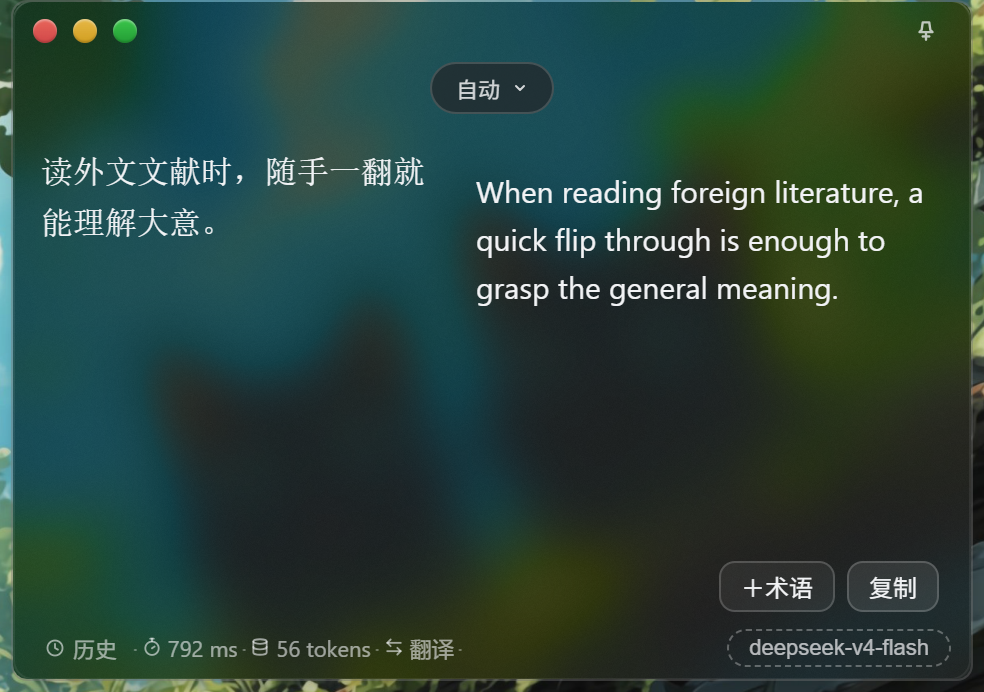
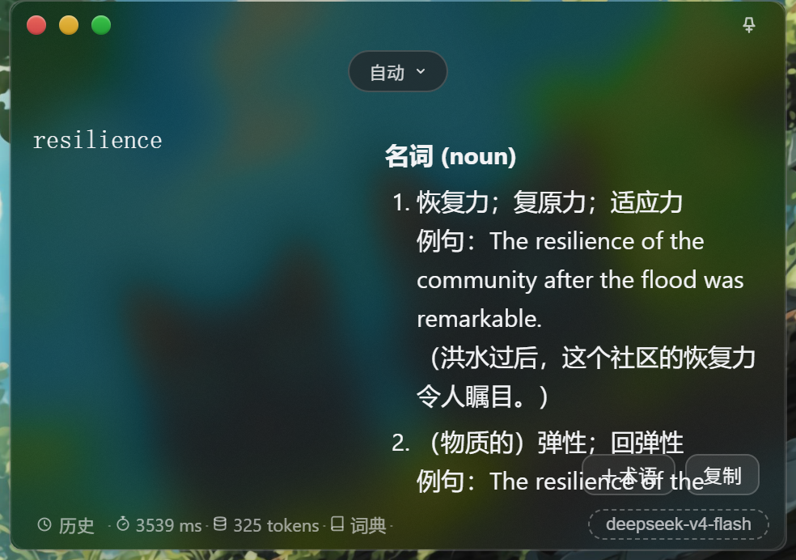
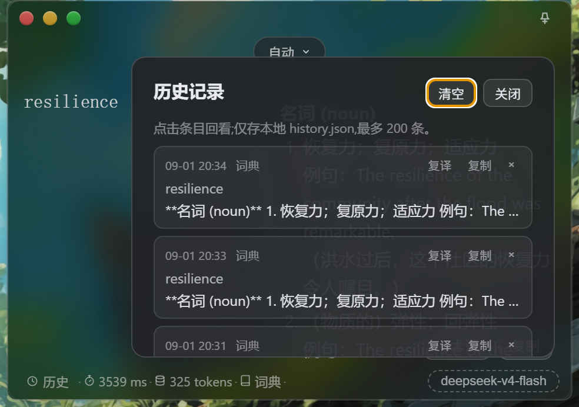

### 注意，外侧文件夹用于开发，几个以github-开头的文件夹是用来整理开发好的文件后推送的，开发时不要碰这两个文件夹


# FrostMirror · 镜语

[](LICENSE)

置顶毛玻璃 AI 翻译小窗 · 译如照镜

一个始终浮在窗口最前面的半透明翻译小窗——复制即翻、输入即译、孤词词典，随叫随到。适合阅读外文资料、写英文邮件时随手一翻。



## 功能特性

**翻译**

- **输入即翻** — 输入文字回车翻译;自动模式:含汉字 → 英文,其他语言 → 设备默认语言
- **复制即翻** — 任意应用复制文本(≤2000 字符),窗口自动浮出翻译,不抢焦点
- **流式输出** — 译文逐字实时渲染,可随时取消(Esc 或发起新请求)
- **深度模式** — 开启模型思考,翻译质量更高,速度更慢、消耗更多 token

**词典与术语**

- **孤词词典** — 输入单个英文单词(可含连字符)自动切换词典模式,列出词性、释义、例句与搭配
- **术语表** — 内置 140 条计算机术语预置包;双通道约束(语境软约束 / 严格占位符保护)、全词匹配、英文复数兼容
- **术语管理** — CSV 批量导入、翻译结果一键收录(冲突有小标记)、词典模式译名置顶

**效率与界面**

- **全局热键** — `Alt+Q` 任意应用呼出窗口,剪贴板有新内容则直接翻译
- **灵动岛语言胶囊** — 顶部可固定目标语言:中 / 英 / 日 / 韩 / 法 / 德 / 西 / 俄 / 葡 / 意,默认自动
- **透明度调节** — `Ctrl+=` / `Ctrl+-` 实时调节,单击 ±5%,长按约 10%/秒,松开自动保存
- **历史记录** — 翻译成功自动存本地(上限 200 条),状态栏入口回看 / 复译 / 复制 / 删除
- **Markdown 渲染** — 译文按 Markdown 渲染(marked 解析 + DOMPurify 消毒),链接经系统浏览器打开
- **系统托盘** — 关闭缩到托盘不退出,单击显示,右键可退出

**隐私与便携**

- **置顶毛玻璃** — Win32 亚克力模糊,始终浮于所有窗口上方,不遮挡阅读
- **本地加密** — API Key 用 Windows DPAPI 加密存储,不落明文
- **便携免安装** — 免安装、双击即用;配置存系统用户目录(`%APPDATA%\FrostMirror\`),挪动 exe 到任意文件夹不会丢设置。首次运行会自动把旧版留在 exe 旁的配置迁移过来
- **单实例** — 重复启动只聚焦已有窗口

## 界面预览





## 下载

免安装便携版:到 [Releases](https://github.com/FROSTultra/FrostMirror/releases) 下载 `FrostMirror-<版本号>-portable.exe`,双击即用。

> 未做代码签名,Windows 可能提示"未知发布者",点"更多信息 → 仍要运行"即可。

## 从源码运行

前置要求:

- Windows 10 1803+ / Windows 11(依赖 Win32 亚克力模糊 API)
- Node.js v18+、npm v9+
- 任意 OpenAI 兼容接口的 API Key(如 DeepSeek、OpenAI、Moonshot),首次启动按引导填写

```bash
npm install
npm start
```

> 国内网络若 `npm install` 下载 Electron 二进制失败,可先设置镜像(PowerShell):
> `$env:ELECTRON_MIRROR = "https://npmmirror.com/mirrors/electron/"`

## 使用

1. **首次启动** — 两步引导:介绍 → 填写 OpenAI 兼容接口地址、模型 ID 与 API Key,点"保存并验证"
2. **翻译** — 输入文字回车;双击结果区或按 Esc 返回输入
3. **复制即翻** — 任意应用里 `Ctrl+C` 复制文本即自动翻译(可在设置中关闭)
4. **词典** — 输入单个英文单词自动进入词典模式
5. **热键** — `Alt+Q` 呼出并翻译剪贴板内容(可在设置中改绑)

快捷键:

| 快捷键 | 功能 |
|---|---|
| `Alt+Q` | 任意应用呼出窗口 |
| `Ctrl+=` / `Ctrl+-` | 透明度增加 / 降低 |
| `Esc` | 关闭弹窗;结果视图返回输入框 |
| 双击结果区 | 返回输入框 |

窗口右上角:图钉切换置顶;红绿灯依次为关闭(缩到托盘)/ 最小化 / 最大化。

## 术语表 CSV 格式

`source,target,description,case_sensitive`(仅前两列必填),例如:

```csv
source,target,description,case_sensitive
token,令牌,大模型处理的文本基本单位,false
```

可通过设置中的"导入 CSV"批量导入,或在翻译结果旁一键收录当前词组。

## 技术要点

- **毛玻璃**:直接调 Win32 `SetWindowCompositionAttribute`(亚克力 + 灰色 tint);Electron 的 `backgroundMaterial` 在 Win11 24H2+ 有已知 bug,旧系统自动退回 blur-behind / 实色底
- **翻译接口**:OpenAI 兼容 `/chat/completions`,主进程发请求无 CORS 问题;SSE 流式解析(40ms 节流),`stream_options.include_usage` 精确统计 token,思考流丢弃;默认关闭 `thinking`(翻译不需要思考,避免拖慢),深度模式开启并降推理强度;不认参数的服务端自动去参重试
- **术语匹配**:双通道——语境软约束(默认,提示模型优先采用译名)与严格占位符保护(翻译前替换为占位符、结束后还原,保证译名不被改);全词匹配,兼容英文复数
- **安全**:API Key 用 Electron `safeStorage`(Windows DPAPI)加密;AI 输出视为不可信输入,经 DOMPurify 消毒后再渲染;渲染库本地存放 `assets/vendor/`,离线可用
- **便携**:免安装、数据存 `%APPDATA%\FrostMirror\`(exe 挪动不丢配置;旧版 exe 旁配置首次运行自动迁移);DPAPI 密文绑定原账户,换电脑后需重新填写 API Key

## 开源依赖

| 项目 | 版本 | 用途 | 许可证 |
|---|---|---|---|
| [Electron](https://github.com/electron/electron) | ^43.4.0 | 运行时框架 | MIT |
| [koffi](https://github.com/Koromix/koffi) | ^3.1.5 | FFI 调用 Win32 亚克力 API | MIT |
| [marked](https://github.com/markedjs/marked) | 18.0.10 | Markdown 解析(本地化于 `assets/vendor/`) | MIT |
| [DOMPurify](https://github.com/cure53/DOMPurify) | 3.4.14 | HTML 消毒(本地化于 `assets/vendor/`) | Apache-2.0 / MPL-2.0 |

发布便携包时须随包附带上述许可证文本。

## 常见问题

**Q: 换电脑后 API Key 失效了?**

A: API Key 用 Windows DPAPI 加密,绑定当前系统账户。换电脑或换账户后密文无法解密,需在设置中重新填写一次;其他配置(语言、透明度等)不受影响。

**Q: 亚克力模糊效果不生效?**

A: 需要 Windows 10 1803 或更高版本。系统不支持时自动退回实色背景;Win11 24H2+ 的 Electron `backgroundMaterial` 有已知 bug,本项目直接调 Win32 API 绕过。

**Q: 复制即翻译没有反应?**

A: 检查设置中"复制即翻"开关是否开启;剪贴板内容超过 2000 字符不触发;窗口获得焦点时(正在本窗口内操作)也不自动翻译,避免打断。

**Q: 支持哪些 AI 接口?**

A: 任何兼容 OpenAI `/chat/completions` 格式的接口均可,如 DeepSeek、OpenAI、Moonshot 等,填写接口地址、模型 ID 与 API Key 即可。

## 许可证

本项目以 [BSD-3-Clause](LICENSE) 协议开源。
